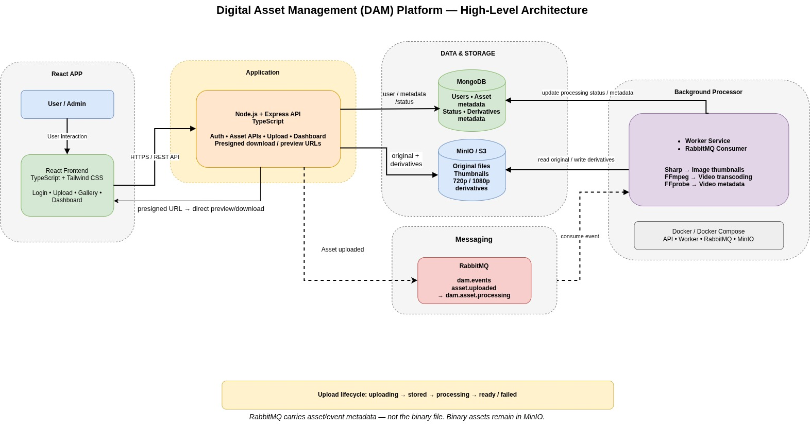

# Digital Asset Management (DAM) Platform — Frontend

Frontend application for a Digital Asset Management (DAM) platform built with React, TypeScript, and Tailwind CSS.

The frontend provides the user interface for authentication, asset uploading, asset browsing, pagination, media preview, video quality selection, and dashboard information.

The application communicates with the Node.js/Express backend through REST APIs and uses presigned URLs to preview and access assets directly from MinIO.

---

## Overview

The DAM frontend provides a centralized interface for managing digital assets such as:

- Images
- Videos
- Documents
- Other supported files

The frontend is responsible for the presentation layer and user interaction.

The backend is responsible for:

- Authentication
- Authorization
- Asset metadata
- File storage
- Background processing
- Presigned URL generation

The frontend communicates with the backend using REST APIs.

For media preview and download, the backend generates temporary presigned URLs that allow the browser to access objects directly from MinIO.

---

## Architecture



### High-Level Frontend Flow

```text
                         User / Admin
                              |
                              v
                       React Frontend
                              |
                       HTTPS / REST API
                              |
                              v
                    Node.js + Express API
                       /       |        \
                      /        |         \
                     v         v          v
                MongoDB      MinIO      RabbitMQ
                               ^
                               |
                         Presigned URL
                               |
                               |
                         React Frontend
```

The frontend does not communicate directly with:

- MongoDB
- RabbitMQ
- Worker Service

The frontend communicates with the backend API.

When the backend returns a presigned URL, the browser can access the corresponding object in MinIO directly.

---

# Technology Stack

| Technology | Purpose |
|---|---|
| React | UI development |
| TypeScript | Static typing |
| Tailwind CSS | Styling and responsive UI |
| Vite | Frontend build tool and development server |
| React Hooks | Component and application state |
| Fetch API | Backend API communication |
| Vitest | Testing |

---

# Features

## Authentication

The frontend provides:

- User registration
- User login
- JWT-based authentication
- Authentication token handling
- Protected routes
- Logout
- Authentication-aware navigation
- Redirect unauthenticated users to the login page

Authentication flow:

```text
User
 |
 v
Login Page
 |
 | Credentials
 v
Backend API
 |
 | JWT
 v
Frontend
 |
 | Store token
 v
Protected Application
```

---

# Protected Routes

Application pages that require authentication are protected.

The general flow is:

```text
User opens protected page
          |
          v
Check authentication
          |
      +---+---+
      |       |
     Yes      No
      |       |
      v       v
Protected    Login
Page         Page
```

If the user does not have a valid authentication token, the application redirects the user to the login page.

Protected areas include application functionality such as:

- Dashboard
- Asset gallery
- Asset upload
- Asset management

---

# Asset Upload

The frontend provides an asset upload interface.

The current upload flow is:

```text
User
 |
 | Select file
 v
Upload Component
 |
 | FormData
 v
AssetsService
 |
 | POST /api/asset
 v
Backend API
 |
 +----> MongoDB
 |
 +----> MinIO
 |
 +----> RabbitMQ
          |
          v
        Worker
          |
          +----> Sharp
          |
          +----> FFmpeg
          |
          +----> FFprobe
```

The frontend sends the selected file using `multipart/form-data`.

The backend stores the original asset in MinIO and publishes an asynchronous processing event to RabbitMQ.

The frontend does not communicate directly with RabbitMQ or the worker.

---

# Asset Gallery

The gallery provides a visual browser for uploaded assets.

The gallery supports:

- Asset cards
- Image thumbnails
- Video thumbnails
- Asset names
- File types
- File sizes
- Asset status
- Image preview
- Video preview
- Pagination
- Loading states
- Empty states
- Error handling

The gallery data flow is:

```text
Gallery
   |
   v
useGallery
   |
   v
AssetsService
   |
   v
API Client
   |
   v
Backend API
   |
   v
Assets + Pagination
   |
   v
Gallery UI
```

---

# Asset Types

The frontend maps backend MIME types into application-level asset types.

```text
image/*
   |
   v
image

video/*
   |
   v
video

audio/*
   |
   v
audio

other
   |
   v
document
```

This allows the UI to render assets according to their type.

---

# Asset Status

The frontend displays the processing state of assets.

Supported statuses include:

```text
uploading
stored
processing
ready
failed
```

The lifecycle is:

```text
uploading
    |
    v
stored
    |
    v
processing
    |
    +----------> ready
    |
    +----------> failed
```

The frontend can use these states to indicate whether an asset is:

- Being uploaded
- Stored
- Being processed
- Ready
- Failed

---

# Image Preview

For image assets, the frontend uses the generated thumbnail URL when available.

```text
Image Asset
     |
     v
thumbnailUrl
     |
     v
Image Preview
```

The thumbnail is generated asynchronously by the backend worker using Sharp.

The frontend does not perform image processing.

---

# Video Preview

Video assets can be previewed directly in the browser using the HTML5 video element.

The video player uses:

- Video source URL
- Thumbnail as poster
- Browser playback controls

Flow:

```text
Video Asset
     |
     v
Backend API
     |
     | Presigned URLs
     v
Frontend
     |
     v
HTML5 Video Player
```

---

# Video Quality Selection

The frontend supports selecting an available video quality.

Available options may include:

```text
1080p
720p
Original
```

The frontend only displays a quality option when the backend has returned the corresponding URL.

Example:

```text
Video Asset
     |
     +----> video1080pUrl
     |
     +----> video720pUrl
     |
     +----> originalUrl
```

The user selects a quality:

```text
Quality Selection
       |
       v
Selected Video URL
       |
       v
HTML5 Video Player
```

This allows users to play a smaller derivative instead of always loading the original high-resolution video.

---

# Presigned URL Flow

The frontend does not generate presigned URLs.

The backend generates them.

The complete flow is:

```text
1. React requests asset information
             |
             v
2. Node.js API
             |
             v
3. Backend generates presigned URL
             |
             v
4. React receives presigned URL
             |
             v
5. React uses presigned URL
             |
             v
6. MinIO serves the object
```

Visually:

```text
React
  |
  | Asset request
  v
Node.js API
  |
  | Generate presigned URL
  v
React
  |
  | Direct request using presigned URL
  v
MinIO
```

The binary file does not need to pass through the Node.js API during direct preview/access.

---

# Preview and Download Flow

The frontend uses the URLs returned by the backend for accessing assets.

Typical URLs include:

```text
thumbnailUrl
video720pUrl
video1080pUrl
originalUrl
```

### Image

```text
thumbnailUrl
     |
     v
Image
```

### Video

```text
video720pUrl
video1080pUrl
originalUrl
     |
     v
Video Player
```

### Original Asset

```text
originalUrl
     |
     v
Browser
     |
     +----> Preview
     |
     +----> Download
```

---

# Dashboard

The frontend provides an admin/dashboard view.

The dashboard displays information such as:

- Total assets
- Image count
- Video count
- Processing assets
- Failed assets
- Ready assets
- Storage information
- Recent assets

The dashboard uses a dedicated React hook.

```text
Dashboard
    |
    v
useDashboard
    |
    v
AssetsService
    |
    v
Backend API
    |
    v
Asset Data
    |
    v
Dashboard Statistics
```

The current dashboard statistics are derived from the assets retrieved by the frontend.

A dedicated backend dashboard statistics API can be introduced later if global statistics across all assets are required.

---

# Pagination

The gallery uses server-side pagination.

The frontend sends:

```text
GET /api/asset?page=1&limit=6
```

The backend returns:

```text
assets
pagination
```

Pagination information includes:

```text
page
limit
total
totalPages
hasNextPage
hasPreviousPage
```

The frontend uses this information to provide page navigation.

---

# Gallery Data Flow

```text
Gallery
   |
   v
useGallery
   |
   | page / limit
   v
AssetsService.fetchAllAssets()
   |
   v
GET /api/asset?page=X&limit=Y
   |
   v
Backend
   |
   v
AssetsResponse
   |
   +---- assets
   |
   +---- pagination
   |
   v
Gallery
```

---

# API Client

The frontend uses a centralized API client for backend communication.

The API client is responsible for common request configuration such as:

- Backend API URL
- Authentication token
- Request configuration
- API requests
- Authentication headers

Services use the API client instead of duplicating request configuration across components.

---

# Service Layer

Backend communication is separated from UI components.

The general architecture is:

```text
React Component
       |
       v
Custom Hook
       |
       v
Service Layer
       |
       v
API Client
       |
       v
Backend API
```

This keeps HTTP communication outside the presentation components.

---

# AssetsService

The asset service handles asset-related API operations.

Responsibilities include:

- Fetching assets
- Uploading assets
- Mapping backend asset responses
- Mapping MIME types to frontend asset types
- Handling authentication requirements
- Handling API errors
- Returning normalized asset data

The service converts the backend asset representation into the frontend `Asset` model.

---

# Frontend Asset Model

The frontend uses an `Asset` type similar to:

```text
Asset
├── id
├── ownerId
├── name
├── type
├── mimeType
├── size
├── status
├── storage
├── thumbnailUrl
├── video720pUrl
├── video1080pUrl
├── originalUrl
├── createdAt
└── updatedAt
```

This provides a consistent structure for components, hooks, and services.

---

# React Component Architecture

The frontend uses reusable React components.

A simplified structure is:

```text
Application
│
├── Authentication
│   ├── Login
│   └── Register
│
├── Dashboard
│   ├── Dashboard Header
│   ├── Statistics
│   └── Recent Assets
│
├── Gallery
│   ├── Gallery Header
│   ├── Gallery Toolbar
│   ├── Gallery Result Info
│   ├── Gallery Grid
│   ├── Gallery List
│   ├── Gallery Skeleton
│   └── Asset Card
│
└── Shared Components
    ├── Sidebar
    ├── Navigation
    └── UI Components
```

---

# Custom React Hooks

The frontend separates data-fetching and application logic from UI components using custom hooks.

Examples include:

```text
useDashboard
useGallery
```

## useDashboard

Responsible for:

- Loading dashboard assets
- Managing loading state
- Calculating dashboard statistics
- Calculating storage information

## useGallery

Responsible for:

- Loading assets
- Managing pagination
- Changing pages
- Managing gallery state
- Resetting pagination when required

This keeps UI components focused primarily on presentation.

---

# State Management

The current frontend primarily uses React's built-in state management.

Common hooks include:

```text
useState
useEffect
useMemo
```

## useState

Used for local component state such as:

- Selected video quality
- Dropdown visibility
- Loading state
- Pagination state

## useEffect

Used for side effects such as:

- Fetching assets
- Detecting click-outside events
- Reacting to state changes

## useMemo

Used for appropriate derived values where memoization is useful.

The current application does not require Redux for the implemented feature set because most state is local or page-level.

If the application grows to require complex shared client-side state across many unrelated components, Redux Toolkit or another centralized state-management solution can be introduced.

---

# Authentication State Flow

The frontend uses the authentication token for protected API requests.

The general flow is:

```text
Login
  |
  v
Backend
  |
  v
JWT
  |
  v
Frontend
  |
  v
Token Storage
  |
  v
API Client
  |
  v
Protected API Requests
```

When the authentication token is unavailable, protected pages redirect the user to the login page.

---

# Loading States

The frontend provides loading states while API requests are running.

Example:

```text
API Request
    |
    v
Loading
    |
    v
Gallery Skeleton
    |
    v
API Response
    |
    v
Gallery
```

Loading states prevent the UI from appearing empty while data is being retrieved.

---

# Error Handling

The frontend handles API and application errors.

Typical cases include:

- Authentication failure
- Invalid credentials
- Asset upload failure
- Asset retrieval failure
- Backend unavailable
- Missing authentication token
- Failed asset processing

The service layer converts API failures into errors that can be handled by React components and hooks.

---

# Empty States

The gallery handles situations where no assets are available.

Example:

```text
No Assets
    |
    v
Empty Gallery State
    |
    v
Upload Asset
```

This gives the user a clear next action.

---

# Responsive UI

The frontend uses Tailwind CSS to provide a responsive interface.

Responsive areas include:

- Sidebar
- Gallery
- Asset cards
- Dashboard
- Upload interface
- Navigation
- Video player

Tailwind responsive utility classes are used to adapt the interface to different screen sizes.

---

# Styling

Tailwind CSS is used for styling and layout.

Benefits include:

- Utility-first styling
- Responsive design
- Consistent spacing
- Reusable UI patterns
- Faster component development
- Reduced need for separate CSS files

---

# Frontend Project Structure

A typical project structure is:

```text
dam-frontend/
│
├── src/
│   │
│   ├── components/
│   │   ├── gallery/
│   │   │   ├── GalleryHeader.tsx
│   │   │   ├── GalleryToolbar.tsx
│   │   │   ├── GalleryResultInfo.tsx
│   │   │   ├── GalleryGrid.tsx
│   │   │   ├── GalleryList.tsx
│   │   │   ├── GallerySkeleton.tsx
│   │   │   └── AssetCard.tsx
│   │   │
│   │   ├── dashboard/
│   │   ├── auth/
│   │   ├── layout/
│   │   └── ...
│   │
│   ├── hooks/
│   │   ├── useGallery.ts
│   │   ├── useDashboard.ts
│   │   └── ...
│   │
│   ├── services/
│   │   ├── ApiClient.ts
│   │   ├── AssetsService.ts
│   │   └── ...
│   │
│   ├── types/
│   │   ├── Assets.ts
│   │   └── ...
│   │
│   ├── pages/
│   │   ├── Login.tsx
│   │   ├── Register.tsx
│   │   ├── Dashboard.tsx
│   │   └── Gallery.tsx
│   │
│   ├── App.tsx
│   └── main.tsx
│
├── public/
├── package.json
├── pnpm-lock.yaml
├── tsconfig.json
├── vite.config.ts
└── README.md
```

> The exact directory structure may vary slightly depending on the current implementation.

---

# Environment Variables

Create a `.env` file in the frontend root.

Example:

```env
VITE_API_BASE_URL=http://localhost:4000
```

Vite exposes frontend environment variables through the `VITE_` prefix.

Example:

```ts
import.meta.env.VITE_API_BASE_URL
```

Frontend environment variables are bundled into client-side code.

Therefore, private secrets must never be stored in frontend environment variables.

Do not expose:

```text
MongoDB credentials
RabbitMQ credentials
MinIO secret keys
JWT signing secrets
Private API credentials
```

---

# Local Development

## Prerequisites

Install:

- Node.js
- pnpm

The backend services should also be running when using the complete DAM application.

---

# Install Dependencies

```bash
pnpm install
```

---

# Run Development Server

```bash
pnpm dev
```

The Vite development server will display the frontend URL in the terminal.

---

# Build

```bash
pnpm build
```

---

# Preview Production Build

```bash
pnpm preview
```

---

# Frontend and Backend Communication

The frontend communicates with the backend using REST APIs.

```text
React
 |
 | HTTP / HTTPS
 v
Node.js + Express
 |
 +----> MongoDB
 |
 +----> MinIO
 |
 +----> RabbitMQ
          |
          v
        Worker
```

The frontend does not communicate directly with MongoDB, RabbitMQ, or the worker service.

---

# Complete Upload Flow

```text
User
 |
 | Select file
 v
React Upload Component
 |
 | multipart/form-data
 v
AssetsService
 |
 v
Node.js API
 |
 +----> MongoDB
 |       Asset metadata
 |
 +----> MinIO
 |       Original file
 |
 +----> RabbitMQ
         asset.uploaded
              |
              v
         Worker Service
              |
              +----> Sharp
              |
              +----> FFmpeg
              |
              +----> FFprobe
              |
              v
            MinIO
              |
              v
            MongoDB
              |
              v
        status = ready
```

---

# Complete Preview Flow

```text
User
 |
 v
Gallery
 |
 | Request asset
 v
Backend API
 |
 | Generate presigned URL
 v
React
 |
 | Direct object request
 v
MinIO
 |
 v
Browser
 |
 +----> Image Preview
 |
 +----> Video Playback
 |
 +----> File Download
```

---

# Complete Video Flow

```text
User uploads video
        |
        v
React
        |
        v
Node.js API
        |
        v
MinIO
        |
        v
RabbitMQ
        |
        v
Worker
        |
        +----> FFprobe
        |       metadata
        |
        +----> FFmpeg
                |
                +----> thumbnail
                +----> 720p
                +----> 1080p
                        |
                        v
                      MinIO
                        |
                        v
                     MongoDB
                        |
                        v
                      ready
```

The frontend receives the available video URLs through the backend API and allows the user to select the desired quality.

---

# Security

The frontend follows several security practices:

- Protected application routes
- JWT-based authentication
- Authentication token required for protected API requests
- No database credentials in frontend code
- No RabbitMQ credentials in frontend code
- No private MinIO credentials in frontend code
- Presigned URLs used for temporary object access
- Backend remains responsible for authorization
- Frontend does not directly access MongoDB
- Frontend does not directly access RabbitMQ

The backend remains the source of truth for authentication and authorization.

---

# Performance Considerations

The frontend uses several techniques to reduce unnecessary work and network usage:

- Server-side pagination
- Generated thumbnails for gallery previews
- Video derivatives for different playback qualities
- Direct MinIO access using presigned URLs
- Reusable React components
- Custom hooks for data-fetching logic
- Appropriate use of `useMemo`
- Loading skeletons
- Conditional rendering

Using generated thumbnails prevents the gallery from loading large original images unnecessarily.

Using video derivatives allows the browser to play an appropriate resolution rather than always loading the original high-resolution video.

---

# Testing

The frontend can be tested using the configured test tooling.

Run:

```bash
pnpm test
```

For coverage, if configured:

```bash
pnpm test --coverage
```

Recommended frontend test areas include:

- Login component
- Registration component
- Protected routes
- API client
- AssetsService
- Asset type mapping
- Gallery rendering
- Pagination
- Dashboard calculations
- Video quality selection
- Loading states
- Error states

---

# Production Build

Create a production build:

```bash
pnpm build
```

The generated build can be served through a production web server or static hosting platform.

A typical production architecture is:

```text
                    Internet
                       |
                       v
                React Frontend
                       |
                       | HTTPS
                       v
                 Backend API
                    /     \
                   /       \
                  v         v
             MongoDB      MinIO
                             ^
                             |
                          Worker
                             ^
                             |
                         RabbitMQ
```

---

# Production Considerations

For production deployment, the frontend can be further improved with:

- CDN integration
- Asset caching
- Code splitting
- Lazy loading
- Virtualized gallery for very large collections
- Better upload progress handling
- Retry failed uploads
- Cancel active uploads
- Improved accessibility
- Error boundaries
- End-to-end testing
- Performance monitoring
- Frontend logging
- Content Security Policy
- Secure authentication storage strategy

---

# Future Improvements

Potential frontend improvements include:

1. Multi-file upload UI
2. Drag-and-drop upload
3. Upload progress indicators
4. Cancel active uploads
5. Retry failed uploads
6. Bulk asset operations
7. Bulk download
8. Asset deletion
9. Asset sharing
10. Advanced search
11. Advanced filtering
12. Server-side sorting
13. Asset tagging UI
14. Asset categorization
15. Download tracking
16. Advanced dashboard analytics
17. Redis-backed analytics integration
18. Virtualized gallery
19. Improved video player controls
20. Better error recovery
21. Accessibility improvements
22. Comprehensive frontend unit tests
23. End-to-end testing
24. CDN integration

---

# Current Scope

The implemented frontend covers the core DAM workflow:

```text
Authentication
      |
      v
Dashboard
      |
      v
Asset Upload
      |
      v
Asset Gallery
      |
      +----> Pagination
      |
      +----> Image Preview
      |
      +----> Video Preview
      |
      +----> Video Quality Selection
      |
      v
Presigned URL
      |
      v
MinIO
```

---

# End-to-End Application Flow

```text
                         User / Admin
                              |
                              v
                       React Frontend
                              |
                              | HTTPS / REST
                              v
                    Node.js + Express API
                       /       |        \
                      /        |         \
                     v         v          v
                MongoDB      MinIO      RabbitMQ
                   |           |           |
                   |           |      asset.uploaded
                   |           |           |
                   |           |           v
                   |           |     Worker Service
                   |           |           |
                   |           |      +----+----+
                   |           |      |    |    |
                   |           |    Sharp FFmpeg FFprobe
                   |           |      |    |    |
                   |           |      +----+----+
                   |           |           |
                   |           <-----------+
                   |                       |
                   +-----------------------+
```

For preview/download:

```text
React
  |
  | Request asset
  v
Node.js API
  |
  | Generate presigned URL
  v
React
  |
  | Direct access
  v
MinIO
```

---

# Design Principles

## Separation of Concerns

The frontend separates:

```text
UI
 |
 v
Hooks
 |
 v
Services
 |
 v
API Client
 |
 v
Backend
```

This prevents API communication and business-related frontend logic from being tightly coupled to individual UI components.

---

## Component Reusability

The UI is divided into reusable components instead of placing all functionality inside large page components.

Examples include:

- Gallery components
- Asset cards
- Dashboard components
- Sidebar
- Authentication components
- Loading components

---

## Backend Responsibility

The frontend is responsible for:

```text
Presentation
User interaction
Client-side state
API communication
```

The backend is responsible for:

```text
Authentication
Authorization
Business logic
Metadata
Object storage
Background processing
Presigned URL generation
```

This separation keeps security-sensitive operations on the server side.

---

# Summary

The DAM frontend provides a React-based interface for managing digital assets.

The main architecture is:

```text
React
  |
  | REST API
  v
Node.js + Express
  |
  +----> MongoDB
  |
  +----> MinIO
  |
  +----> RabbitMQ
             |
             v
          Worker
             |
       +-----+-----+
       |     |     |
     Sharp FFmpeg FFprobe
       |     |     |
       +-----+-----+
             |
             v
           MinIO
             |
             v
          MongoDB
```

The frontend uses presigned URLs for direct asset access:

```text
React
  |
  | Request
  v
API
  |
  | Presigned URL
  v
React
  |
  | Direct access
  v
MinIO
```

The key architectural principle is:

> **React handles the user interface and application interaction, the Node.js API handles business operations and authorization, MongoDB stores metadata, MinIO stores binary assets, RabbitMQ handles asynchronous processing events, and the worker performs CPU-intensive media processing.**

---

# License

This project is developed as a learning and demonstration project for exploring production-oriented Digital Asset Management architecture, asynchronous processing, object storage, media processing, React application architecture, and containerized backend services.